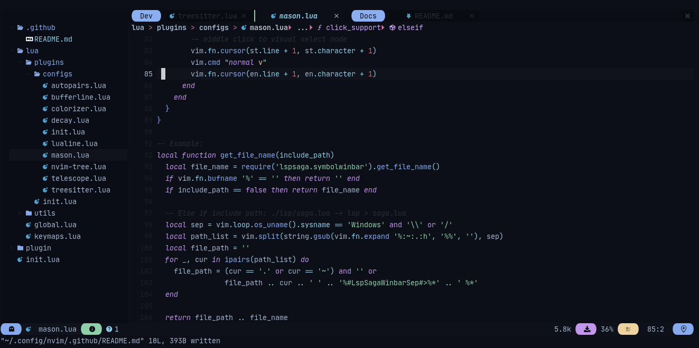

# Alpha's Nvim Configuration

This is configuration for nvim that aims to make neovim into a full-featured IDE
but without provide a complex code-base.

> Also, this doesn't provides a custom configuration file or something similar,
to make something in the behavior of how something works, you have to change the
configuration files inside the config.



## Installation

In order to install this correctly, you have to follow the next steps:

1. Install packer (I'll add support to auto-packer installation soon):

```sh
git clone --depth 1 https://github.com/wbthomason/packer.nvim\
 ~/.local/share/nvim/site/pack/packer/start/packer.nvim
```

> If you want, you can see more instructions [here](https://github.com/wbthomason/packer.nvim)

2. Install the config

```sh
git clone --depth=1 https://github.com/AlphaTechnolog/nvide.git ~/.config/nvim
```

Then, install the plugins and re-start nvim.

```sh
nvim +PackerInstall
```

## Explaining the config

- `lua/global.lua`: Defines the global variables, like `cursorline` and others.
- `lua/keymaps.lua`: Defines the default keymaps, and exports helpers functions to make keymaps more easier.
- `lua/utils/hi.lua`: Export functions to extract foreground and background from vim's highlights.
- `lua/plugins`: Plugins management folder.
- `lua/plugins/init.lua`: File that defines the plugins that should be installed.
- `lua/plugins/configs/init.lua`: File that imports the configurations of all the plugins.
- `lua/plugins/configs/*`: Configuration files for all the plugins

## Enjoy

That's all, if you liked this, gimme a star ;)
